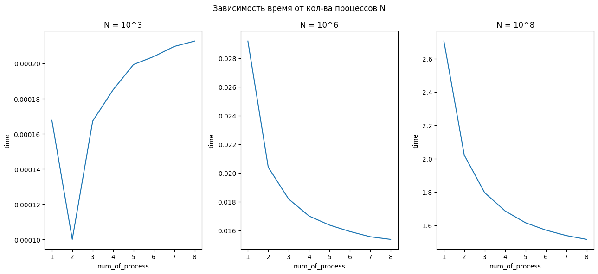

##  Numerical Integration with MPI

###  To check the program's operation you need
1. mkdir build && cd build
2. cmake .. && make
3. cd ../bin
4. chmod +x main.sh
5. sbatch main.sh (in the main.sh file you can select the numbers p and N)

### To plot a graph
1. mkdir build && cd build
2. cmake .. && make
3. cd ../bin
4. chmod +x run.sh && chmod +x my_run.sh
5. ./run.sh
6. In the file bin/data.txt (You can find the data that was used to create the graph)
7. cd .. && python3 graph.py (To plot a graph)

### Graph:

